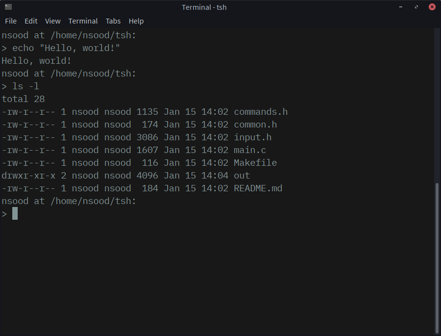

# tsh - Turtle SHell

A simple shell written in C. It takes commands and it runs them.

Why turtle? Because turtles have shells.

**Note:** since this shell uses Unix-specific headers, it will likely not run on Windows. I have not tested it on Windows or macOS.

## Build

    # production
    make it
    # or debug
    make debug

## Run

    out/tsh

## License

Code is provided under the MIT license; see LICENSE.md.
